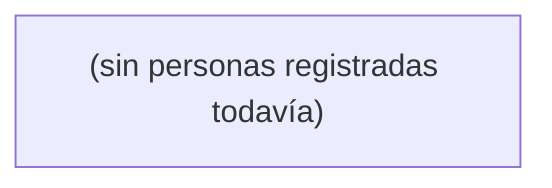

> Autogenerado a partir del frontmatter `reporta-a` de las fichas en esta carpeta.
> Lo regeneran /x-procesar-inbox y /x-curar cuando cambian las fichas.

# Huecos conocidos

_Ninguno todavía. Cuando falte una relación de reporte, listarla aquí y crear la Pregunta correspondiente._
